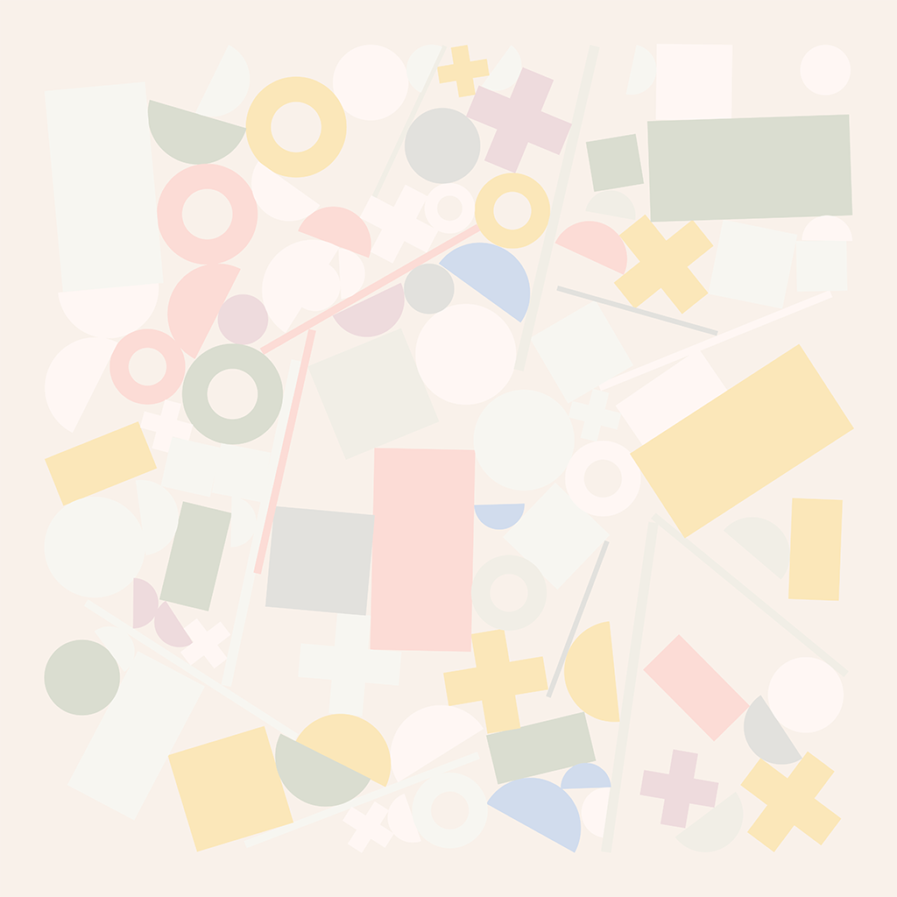

# Palletize

Tools for collections of colors.

Insert a library of color swatches, then query individual or batches of swatches based on visual attributes.
Consumes a hex string for each swatch, then calculates and attaches additional data points for `rgba`, `hsla`, and `luminance`.

## Installation

Install the `palletize` package

```
npm i palletize
```

## Usage

1. Prepare your library of swatches. Each swatch must have a unique `id` string and `hex` string properties:

```
[
  {
    "id": "naturally-white",
    "hex": "#fffffd",
  },
  {
    "id": "egyptian-cotton",
    "hex": "#fdfdfb",
  },
  {
    "id": "cotton",
    "hex": "#fffef9",
  },
  ...
]
```

2. Initialize a palette using the library:

```
const Palletize = require('palletize')
const Palette = Palletize(require('./natural-paint-co.json'))
```

3. Query swatches using the fetcher methods (detailed below)

```
const color = Palette.id('cotton')
console.log(color)
```

## API

### `id(id)`

Query a single swatch by it's `id`

### `random(n = 1)`

Query randomized swatches from the whole library

### `luminance(min, max, n = 1)`

Query randomized swatches within a luminance range

### `hue(theta, range, n = 1)`

Query randomized swatches within a range on the hue wheel  
`theta`: Degrees around the hue wheel 0:red -> 120:green -> 240:blue  
`range`: Degrees in either direction on the wheel to include in results

### `saturation(min, max, n = 1)`

Query randomized swatches within a saturation range

### `lightness(min, max, n = 1)`

Query randomized swatches within a lightness range

### `hsl(hue, saturation, lightness, n = 1)`

Query randomized swatches that match the HSL ranges  
`hue`: `[theta, range]`  
`saturation`: `[min, max]`  
`lightness`: `[min, max]`

### Exclude

All randomized methods can provide an `exclude` array as the final argument; these items are excluded from the selection process:

```
const background = Palette.id('cotton')
const colors = Palette.random(10, [background]) // `Cotton` swatch excluded from selection pool
```

## Examples

```
Palette.id('black-robin')
```

<p align="center"></p>

---

```
Palette.random(10)
```

<p align="center"></p>

---

```
Palette.luminance(0, 0.2, 10)
```

<p align="center"></p>

---

```
Palette.luminance(0.6, 1, 10)
```

<p align="center"></p>

---

```
Palette.hue(0, 15, 10)
```

<p align="center"></p>

---

```
Palette.hue(120, 30, 10)
```

<p align="center"></p>

---

```
Palette.hue(200, 30, 10)
```

<p align="center"></p>

---

```
Palette.saturation(0.5, 1, 10)
```

<p align="center"></p>

---

```
Palette.saturation(0, 0.1, 10)
```

<p align="center"></p>

---

```
Palette.lightness(0, 0.33, 10)
```

<p align="center"></p>

---

```
Palette.lightness(0.8, 1, 10)
```

<p align="center"></p>

---

```
Palette.hsl([0, 45], [0.5, 1], [0.7, 1], 10)
```

<p align="center"></p>

---

```
Palette.hsl([150, 35], [0, 0.33], [0, 0.5], 10)
```

<p align="center"></p>

---

```
Palette.hsl(undefined, [0.5, 1], [0.5, 1], 10)
```

<p align="center"></p>
